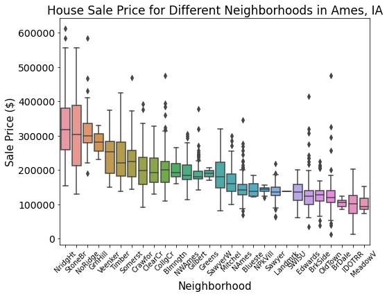

# Problem Statement

The Gardner Real Estate Company is looking into increase sales in the Ames, Iowa region. To increase market share the company has decided that an application where customers can input specific house details and receive a sale price would set them apart from the competition. The house price predicting model should be easy to understand and provide a reasonably accurate estimate of a home's sale price. 

# Dataset

The data analyzed was from the Ames Assessor's Office and was utilized in computing assessed values for individual residential properties sold in Ames, IA from 2006 to 2010. Data dictionary is shown [below](#Data-Dictionary)

# Executive Summary

There are 80 different features recorded for each house sold in Ames, IA. We looked at all 23 nominal, 23 ordinal, 14 discrete, and 20 continuous features to determine the features which were the most directly correlated to the house's sale price. We decided that while a more complex model might be slightly more precise at predicting sale price, a simpler model allows customers to easily determine what their own house might be worth.

There were 11 features which we found to have the largest impact on sale price while also being simple enough for all customers to understand.

|  |**Model Features**|  | 
| --- | :---: | --- | 
|  |**Numeric**|  | 
| Lot Area | Overall Quality | Garage Area | 
| Total Bathrooms | Total Square Feet | Remodel Year |
|  |  |  | 
|  |**Catagorical**|  | 
| MS SubClass | Neighborhood | Condition 1 | 
| Exterior Quality | Kitchen Quality |  |

Additionally as we modeled sale prices without using any interaction features customers can directly see how their own house's specifications affect their potential sale price. The following table shows how much a house's sale price would incraese if a certain feature was increased.

|  | **Lot Area** | **Overall Quality** | **Total Square Feet** |  **Garage Square Feet** |  **Remodel Year** |  **Total Bathrooms** |
|:---:|:---:|:---:|:---:|:---:|:---:|:---:|
||||||||
| **Dollar increase** |2.0|10,700|32.4|23.9|248|10,900|

# Conclusions

* A model was created which takes in 11 features (6 numeric and 5 catagorical)
* The simple model correctly predicts the sale price of around 90% of the houses sold in Ames, IA between 2006 and 2010
* The average error in the predicted sale price is about 25,000 dollars

## Next Steps

* Look into creating more powerful model which could be used in combination with the simple model to more accurately predict a house's sale price for customers who want to know the exact price of their house
* Determine the functionality of this model in different regions of Iowa
* See if there are any other housing metrics which could be recorded and incorporated into the model to improve predictions

# Data Dictionary

|
Feature|
Type|
Description|
| --- | --- | --- |
|
Observation Number|
Discrite|
Observation number of house sale|
|
PID|
Nominal|
Parcel identification number - can be used with city web site for parcel review|
|
MS SubClass|
Nominal|
Identifies the type of dwelling involved in the sale|
|
MS Zoning|
Nominal|
Identifies the general zoning classification of the sale|
|
Lot Frontage|
Continuous|
Linear feet of street connected to property|
|
Lot Area|
Continuous|
Lot size in square feet|
|
Street|
Nominal|
Type of road access to property|
|
Alley|
Nominal|
Type of alley access to property|
|
Lot Shape|
Ordinal|
General shape of property|
|
Land Contour|
Nominal|
Flatness of the property|
|
Utilities|
Ordinal|
Type of utilities available|
|
Lot Config|
Nominal|
Lot configuration|
|
Land Slope|
Ordinal|
Slope of property|
|
Neighborhood|
Nominal|
Physical locations within Ames city limits|
|
Condition 1|
Nominal|
Proximity to various conditions|
|
Condition 2|
Nominal|
Proximity to various conditions (if more than one is present)|
|
Bldg Type|
Nominal|
Type of dwelling|
|
House Style|
Nominal|
Style of dwelling|
|
Overall Qual|
Ordinal|
Rates the overall material and finish of the house|
|
Overall Cond|
Ordinal|
Rates the overall condition of the house|
|
Year Built|
Discrete|
Original construction date|
|
Year Remod/Add|
Discrete|
Remodel date (same as construction date if no remodeling or additions)|
|
Roof Style|
Nominal|
Type of roof|
|
Roof Matl|
Nominal|
Roof material|
|
Exterior 1|
Nominal|
Exterior covering on house|
|
Exterior 2|
Nominal|
Exterior covering on house (if more than one material)|
|
Mas Vnr Area|
Continuous|
Masonry veneer area in square feet|
|
Exter Qual|
Ordinal|
Evaluates the quality of the material on the exterior|
|
Exter Cond|
Ordinal|
Evaluates the present condition of the material on the exterior|
|
Foundation|
Nominal|
Type of foundation|
|
Bsmt Qual|
Ordinal|
Evaluates the height of the basement|
|
Bsmt Cond|
Ordinal|
Evaluates the general condition of the basement|
|
Bsmt Exposure|
Ordinal|
Refers to walkout or garden level walls|
|
BsmtFin Type 1|
Ordinal|
Rating of basement finished area|
|
BsmtFin SF 1|
Continuous|
Type 1 finished square feet|
|
BsmtFinType 2|
Ordinal|
Rating of basement finished area (if multiple types)|
|
BsmtFin SF 2|
Continuous|
Type 2 finished square feet|
|
Bsmt Unf SF|
Continuous|
Unfinished square feet of basement area|
|
Total Bsmt SF|
Continuous|
Total square feet of basement area|
|
Heating|
Nominal|
Type of heating|
|
HeatingQ|
Ordinal|
Heating quality and condition|
|
Central Air|
Nominal|
Central air conditioning|
|
Electrical|
Ordinal|
Electrical system|
|
1st Flr SF|
Continuous|
First Floor square feet|
|
2nd Flr SF|
Continuous|
Second floor square feet|
|
Low Qual Fin SF|
Continuous|
Low quality finished square feet (all floors)|
|
Gr Liv Area|
Continuous|
Above grade (ground) living area square feet|
|
Bsmt Full Bath|
Discrete|
Basement full bathrooms|
|
Bsmt Half Bath|
Discrete|
Basement half bathrooms|
|
Full Bath|
Discrete|
Full bathrooms above grade|
|
Half Bath|
Discrete|
Half bathrooms above grade|
|
Bedroom|
Discrete|
Bedrooms above grade (does NOT include basement bedrooms)|
|
Kitchen|
Discrete|
Kitchens above grade|
|
KitchenQual|
Ordinal|
Kitchen quality|
|
TotRmsAbvGrd|
Discrete|
Total rooms above grade (does not include bathrooms)|
|
Functional|
Ordinal|
Home functionality (Assume typical unless deductions are warranted)|
|
Fireplaces|
Discrete|
Number of fireplaces|
|
FireplaceQu|
Ordinal|
Fireplace quality|
|
Garage Type|
Nominal|
Garage location|
|
Garage Yr Blt|
Discrete|
Year garage was built|
|
Garage Finish|
Ordinal|
Interior finish of the garage|
|
Garage Cars|
Discrete|
Size of garage in car capacity|
|
Garage Area|
Continuous|
Size of garage in square feet|
|
Garage Qual|
Ordinal|
Garage quality|
|
Garage Cond|
Ordinal|
Garage condition|
|
Paved Drive|
Ordinal|
Paved driveway|
|
Wood Deck SF|
Continuous|
Wood deck area in square feet|
|
Open Porch SF|
Continuous|
Open porch area in square feet|
|
Enclosed Porch|
Continuous|
Enclosed porch area in square feet|
|
3-Ssn Porch|
Continuous|
Three season porch area in square feet|
|
Screen Porch|
Continuous|
Screen porch area in square feet|
|
Pool Area|
Continuous|
Pool area in square feet|
|
Pool QC|
Ordinal|
Pool quality|
|
Fence|
Ordinal|
Fence quality|
|
Misc Feature|
Nominal|
Miscellaneous feature not covered in other categories|
|
Misc Val|
Continuous|
Dollar value of miscellaneous feature|
|
Mo Sold|
Discrete|
Month Sold (MM)|
|
Yr Sold|
Discrete|
Year Sold (YYYY)|
|
Sale Type|
Nominal|
Type of sale|
|
Sale Condition|
Nominal|
Condition of sale|
|
SalePrice|
Continuous|
Sale price in dollars|

